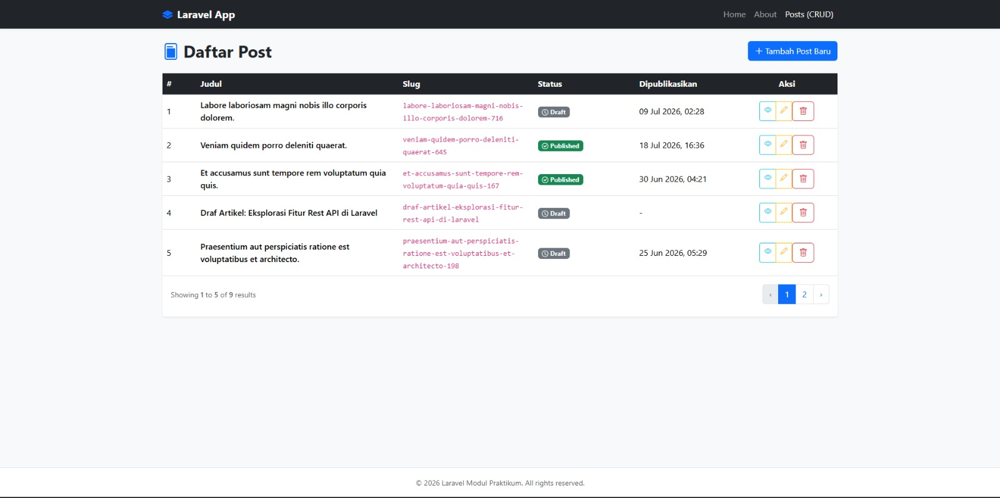
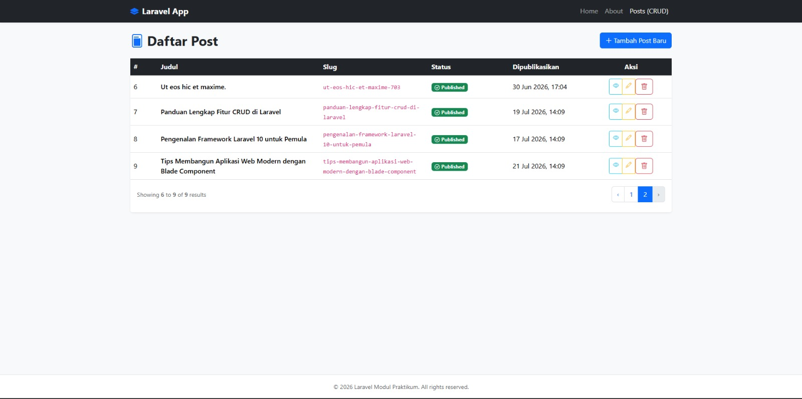
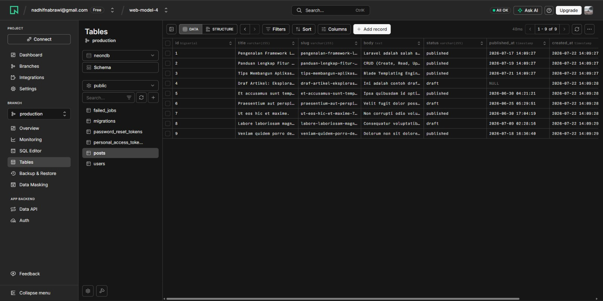

# 🚀 Laporan Praktikum Pemrograman Web - Modul 4

Proyek ini adalah implementasi materi **Praktikum Pemrograman Web (Modul 4)** dari **Bab 2 hingga Bab 7**. Aplikasi dibangun menggunakan framework **Laravel 10** dengan arsitektur berbasis container **Docker** dan terkoneksi ke cloud database **Neon PostgreSQL**.

---

## 🛠️ Tech Stack & Arsitektur

* **Framework**: [Laravel 10](https://laravel.com/) (PHP 8.2)
* **Web Server & Containerization**: [Docker Compose](https://www.docker.com/) (Nginx + PHP-FPM Container)
* **Database**: [Neon DB](https://neon.tech/) (Cloud Serverless PostgreSQL)
* **Frontend Templating**: Laravel Blade Components & Tailwind CSS / Custom Layouts

---

## 🌟 Fitur Utama Aplikasi

1. **Routing & Controller Architecture**: Pengaturan rute terstruktur di `routes/web.php` menggunakan `PageController` dan `PostController`.
2. **Blade Templating & Components**: Penggunaan layout master (`layouts/app.blade.php`) dan reusabel alert component (`partials/alert.blade.php`).
3. **Manajemen CRUD Postings**: Fitur lengkap Tambah, Tampil, Edit, dan Hapus artikel/postingan.
4. **Eloquent ORM & Seeding**: Penggunaan Migration, Model `Post`, `PostFactory`, serta `DatabaseSeeder` untuk menyuntikkan data sampel secara otomatis.

---

## 📸 Bukti Hasil Praktikum (Screenshots)

### 1. Halaman Utama (Home Page)
Tampilan halaman awal aplikasi web Laravel:


---

### 2. Fitur CRUD & Manajamen Postings
Tampilan daftar artikel dan manajemen data post (Create, Read, Update, Delete):


---

### 3. PostgreSQL Cloud Database (Neon DB)
Bukti koneksi dan tabel database yang berhasil dimigrasi serta di-seed di Neon DB:


---

## 🚀 Cara Menjalankan Proyek Secara Lokal

1. **Clone Repository**:
   ```bash
   git clone https://github.com/nadhifnabrawi/web-modul-4.git
   cd web-modul-4
   ```

2. **Konfigurasi Environment (`.env`)**:
   Salin file `.env.example` di folder `src/` menjadi `.env` dan sesuaikan kredensial database Neon DB.

3. **Jalankan Container Docker**:
   ```bash
   docker-compose up -d --build
   ```

4. **Jalankan Migrasi & Database Seeder**:
   ```bash
   docker exec laravel_app php artisan migrate:fresh --seed
   ```

5. **Akses Aplikasi**:
   Buka browser dan akses `http://localhost:8080`
